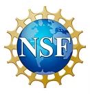
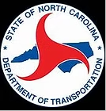
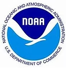

# 🌍 GEMS-HUB 
### **Geospatial and Environmental Management Solutions using Remote Sensing, AI, and Geospatial Intelligence**  

The **Geospatial and Environmental Management Solutions (GEMS-HUB)** initiative at **North Carolina Agricultural and Technical State University (NCAT)** is a **multidisciplinary research hub** integrating **Remote Sensing**, **Artificial Intelligence (AI)**, and **Geospatial Analytics** to tackle global environmental challenges such as **flooding**, **infrastructure vulnerability**, **climate change**, and **sustainable resource management**.

We transform **Earth observation data** into **actionable intelligence** for **disaster resilience**, **climate adaptation**, and **sustainable development**.

---

## 🎯 **Mission & Vision**
Our goal is to establish a **collaborative inter-institutional research program** leveraging synergistic skill sets in **Geospatial Data Science and Analysis**, **GeoAI**, **Remote Sensing**, **Human-Environment Interactions**, and **Environmental Change**.  

Our work is not just theoretical — we are committed to **translating research into actionable solutions** that directly **benefit the communities we serve**.

## 🚀 **Current Projects**

Our team applies these advanced technologies to develop **real-world solutions** for:

- 🌋 **Landslide Detection** and **Susceptibility Mapping**  
- 🌊 **Flood Mapping** and **Flood Depth Estimation**  
- 💧 **Water Quality** and **Chlorophyll Estimation**  
- 🚦 **Traffic Monitoring** and **Transportation System Analysis**  
- 🌾 **Agriculture** and **Crop Health Monitoring**  
- 🔄 **Multimodal Data Fusion** (SAR–Optical)  
- 🔁 **Image Translation** between **SAR** and **Optical** domains  
- 🛰️ **Image Super-Resolution** for both **SAR** and **Optical** imagery  

Each application integrates **AI**, **deep learning**, and **remote sensing** to deliver **scalable, impactful solutions**.

--- 

We aim to:
- Advance **AI-driven geospatial intelligence** for environmental monitoring and decision support  
- Develop **scalable, open-source frameworks** for **flood mapping**, **infrastructure modeling**, and **climate resilience**  
- Build **robust analytical pipelines** for real-time hazard detection  
- Empower researchers and communities through **open data**, **reproducible science**, and **AI innovation**

---

## 🤝 **Collaborations & Funding Partners**

GEMS-HUB proudly collaborates with leading **federal agencies** and **industry partners** to drive geospatial innovation and environmental resilience:

-  **NASA** — Flood mapping, SAR–Optical fusion, Earth observation research  
-  **National Science Foundation (NSF)** — AI for geospatial intelligence, infrastructure resilience modeling  
-  **Microsoft** — Cloud-based AI analytics and Azure pipelines for geospatial data  
-  **North Carolina Department of Transportation (NCDOT)** — Transportation infrastructure mapping, flood impact analysis  
-  **National Oceanic and Atmospheric Administration (NOAA)** — Climate modeling, hydrological forecasting, environmental resilience  

These partnerships strengthen GEMS-HUB’s mission to deliver **AI-powered geospatial solutions** for **disaster management**, **policy planning**, and **sustainable development**.

---

## 🛰️ **Technological Stack**
| Domain | Tools / Frameworks |
|--------|--------------------|
| **Remote Sensing** | Sentinel-1/2, UAV Imagery, LiDAR, SAR Decomposition |
| **AI / ML** | PyTorch, TensorFlow, Scikit-learn, Keras |
| **Geospatial Analytics** | ArcGIS Pro, QGIS, Google Earth Engine, SNAP |
| **Data Engineering** | GDAL, Rasterio, NumPy, Pandas |
| **Visualization** | Plotly, Matplotlib, Power BI, ArcGIS Dashboards |
| **Cloud Platforms** | AWS, Azure, Google Earth Engine |

---

## 🏛️ **Institutional Affiliation**
**North Carolina Agricultural and Technical State University (NCAT)**  
📍 402 Laurel Street, Greensboro, NC 27405, USA  

---

## 👩‍🏫 **Principal Investigator**
**Dr. Leila Hashemi-Beni**  
Associate Professor, Department of Built Environment  
📧 [lhashemibeni@ncat.edu](mailto:lhashemibeni@ncat.edu)  
📞 +1 (630) 888-7036  

---

## 🌐 **Global Engagement**
- 🎓 Presentations at **IGARSS 2025** (Brisbane, Australia)  
- 🌏 Collaborations with **University of Melbourne** and **AUT New Zealand**  
- 🛰️ Participation in **AGU Fall Meetings** and **NC ArcGIS User Conference**  

---

## 🧭 **Open Science Commitment**
We are committed to:
- 📂 **Open-access datasets** for reproducibility  
- 🧠 **Transparent AI models** for geospatial applications  
- 🔬 **Collaborative open-source tools**  
- 🌍 **Cross-sector partnerships** bridging academia, government, and industry  

---

## 🤝 **Join Us**
We welcome collaborations with **researchers**, **students**, and **developers** passionate about **geospatial AI** and **environmental resilience**.

🔗 **Website**: [ncatgems.wixsite.com/gems](https://ncatgems.wixsite.com/gems)  
📧 **Contact**: [lhashemibeni@ncat.edu](mailto:lhashemibeni@ncat.edu)  
📍 **Location**: Greensboro, NC, USA  

---

> _“Empowering the planet through AI, Remote Sensing, and Geospatial Intelligence.”_  
> _In collaboration with NASA, NSF, Microsoft, NCDOT, and NOAA._
